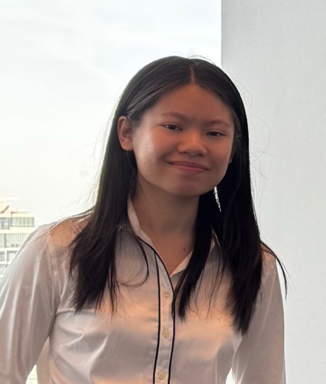
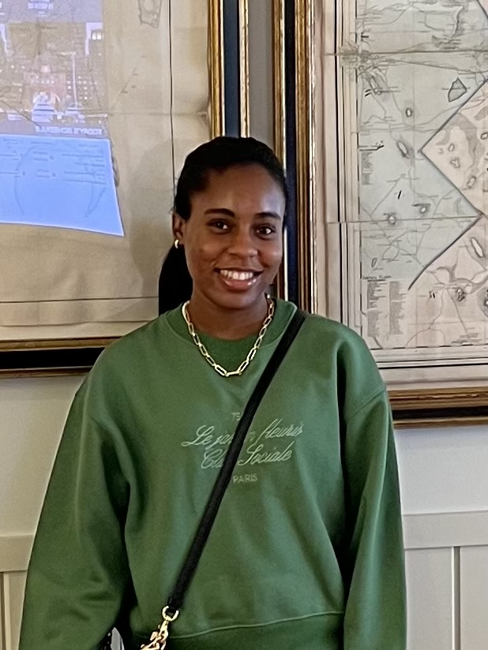
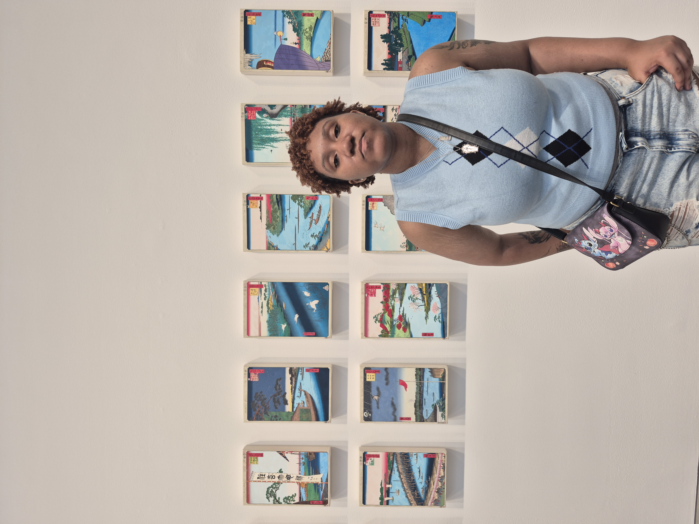

# TEAM 6

## App name
### ReHarvest
## Team members

### Kara

### Kieara

### Nowah

TOADD picture of the team

## App description

## Idea Proposal
[Idea Proposal](https://docs.google.com/document/d/18vtrvUxTi719W6BHrogu7HCJ9SkWPxz4/edit)

## Calendar
[Calendar](https://calendar.google.com/calendar/u/0?cid=aXZoMmU3NjhzMjRkdGlxZWYwcXZvbzhxcjBAZ3JvdXAuY2FsZW5kYXIuZ29vZ2xlLmNvbQ)

## Product Backlog
[Requirements Discovery](https://docs.google.com/document/d/1w4ntAx1MYwu7n99UkwP4cQiqfT1W-xl33NMqhZX0eAQ/edit?tab=t.0)
[Product Backlog Validation](https://paceuniversity-my.sharepoint.com/:w:/g/personal/so35931n_pace_edu/EbGWR2tb9QRMjv0XIB23UEkBZb59fyiaiqdI8XJHVgnhjQ?e=AtOTx4)
[Product Backlog](https://docs.google.com/spreadsheets/d/1voAlLn6wZZea9wKupuXWM1POCDhOYgSrEWuqKm0XB5s/edit?gid=8#gid=8)

## Architecture & Design
[Architecture & Design](https://www.figma.com/design/2PBKC4g2BvtaWByZg1ZssQ/ReHarvest-App?node-id=8-31&t=CQ23PuereT5G0GXq-1)

## Process

### Sprint 1

* [Sprint planning](https://docs.google.com/spreadsheets/d/1voAlLn6wZZea9wKupuXWM1POCDhOYgSrEWuqKm0XB5s/edit?gid=1056044682#gid=1056044682)
* [Scrums](https://docs.google.com/document/d/1YKt-efiRopCJf_IgGwaM3aUJgVgMu5sngq7lSoSOBiU/edit?usp=sharing)
* [Sprint demo video](https://youtu.be/hBSSyLQv-g4)
* [Sprint retrospective](https://docs.google.com/document/d/1W8hoUP1WxisLKzVFcMW2NVzJagehOCELSgSUomdk9KI/edit?usp=sharing)

### Sprint 2

* [Sprint planning](https://docs.google.com/spreadsheets/d/1voAlLn6wZZea9wKupuXWM1POCDhOYgSrEWuqKm0XB5s/edit?gid=1859075779#gid=1859075779)
* [Scrums]()
* [Sprint demo video]()
* [Sprint retrospective]()

### Sprint 3

* [Sprint planning]()
* [Scrums]()
* [Sprint demo video]()
* [Sprint retrospective]()

## Tools & APIs

## Final delivery

* [Final presentation]()
* [Poster]()
* [Process description]()

